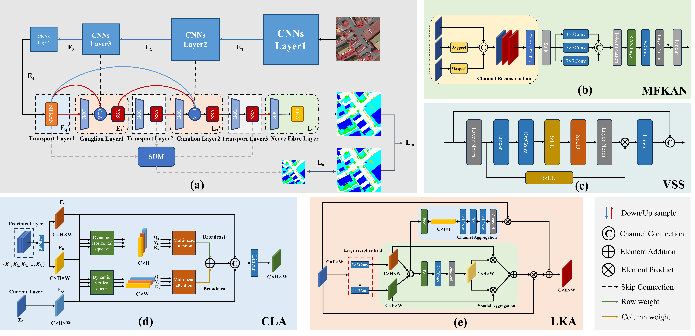

# CLC-UMamba: A Lightweight UNet-Like Mamba based on Cross-Layer Connection Mechanism for High-Resolution Remote Sensing Images
## Introduction

## Overall

<div>

</div>
CLC-UMamba, designed for high-resolution remote sensing images. It employs a Cross-Layer Connection Mechanism and integrates the MFKAN, VSS, DPE, CLA, and LKA modules to improve feature expression and cross-layer reuse efficiency while ensuring a lightweight design.

## Install

step1:creative an environment for project
````shell
conda create -n CLC_UMamba python=3.8
conda activate CLC_UMamba
````

step2:Install pytorch and torchvision matching your CUDA version:
````shell
pip install torch==2.0.0 torchvision==0.16.1 torchaudio==2.1.1
pip install -r CLC_UMamba/requirements.txt
````

step3:Install mamba-ssm and causal-conv1d:
````shell
pip install mamba-ssm==1.1.1 causal-conv1d==1.2.0.post2
````


## Pretrained Weights of UNetMamba

[model_weights](https://pan.baidu.com/s/1mps63vSErk0XL-iaxOEaXA?pwd=pqph) 

## Data Preprocessing

**[Vaihingen](https://www.isprs.org/education/benchmarks/UrbanSemLab/Default.aspx)**

Generate the train set.
````shell
python CLC_UMamba/models/tools/vaihingen_patch_split.py \
--img-dir "data/vaihingen/train_images" \
--mask-dir "data/vaihingen/train_masks" \
--output-img-dir "data/vaihingen/train/images_1024" \
--output-mask-dir "data/vaihingen/train/masks_1024" \
--mode "train" --split-size 1024 --stride 512
````
Generate the validation set.
````shell
python CLC_UMamba/models/tools/vaihingen_patch_split.py \
--img-dir "data/vaihingen/val_images" \
--mask-dir "data/vaihingen/val_masks_eroded" \
--output-img-dir "data/vaihingen/val/images_1024" \
--output-mask-dir "data/vaihingen/val/masks_1024" \
--mode "val" \
--split-size 1024 \
--stride 1024 \
--eroded 
````
Generate the test set.
````shell
python CLC_UMamba/models/tools/vaihingen_patch_split.py \
--img-dir "data/vaihingen/test_images" \
--mask-dir "data/vaihingen/test_masks_eroded" \
--output-img-dir "data/vaihingen/test/images_1024" \
--output-mask-dir "data/vaihingen/test/masks_1024" \
--mode "val" \
--split-size 1024 \
--stride 1024 \
--eroded 
````
Generate the masks_1024_rgb for visualization.
````shell
python CLC_UMamba/models/tools/vaihingen_patch_split.py \
--img-dir "data/vaihingen/test_images" \
--mask-dir "data/vaihingen/test_masks" \
--output-img-dir "data/vaihingen/test_rgb/images_1024" \
--output-mask-dir "data/vaihingen/test_rgb/masks_1024" \
--mode "val" \
--split-size 1024 \
--stride 1024 \
--gt
````

**[Potsdam](https://www.isprs.org/education/benchmarks/UrbanSemLab/default.aspx)**
````shell
python CLC_UMamba/models/tools/potsdam_patch_split.py \
--img-dir "data/potsdam/train_images" \
--mask-dir "data/potsdam/train_masks" \
--output-img-dir "data/potsdam/train/images_1024" \
--output-mask-dir "data/potsdam/train/masks_1024" \
--mode "train" --split-size 1024 --stride 1024 --rgb-image

python CLC_UMamba/models/tools/potsdam_patch_split.py \
--img-dir "data/potsdam/val_images" \
--mask-dir "data/potsdam/val_masks" \
--output-img-dir "data/potsdam/val/images_1024" \
--output-mask-dir "data/potsdam/val/masks_1024" \
--mode "val" --split-size 1024 --stride 1024 --rgb-image

python CLC_UMamba/models/tools/potsdam_patch_split.py \
--img-dir "data/potsdam/test_images" \
--mask-dir "data/potsdam/test_masks_eroded" \
--output-img-dir "data/potsdam/test/images_1024" \
--output-mask-dir "data/potsdam/test/masks_1024" \
--mode "val" --split-size 1024 --stride 1024 \
--eroded --rgb-image

python CLC_UMamba/models/tools/potsdam_patch_split.py \
--img-dir "data/potsdam/test_images" \
--mask-dir "data/potsdam/test_masks" \
--output-img-dir "data/potsdam/test_rgb/images_1024" \
--output-mask-dir "data/potsdam/test_rgb/masks_1024_rgb" \
--mode "val" --split-size 1024 --stride 1024 \
--gt --rgb-image
````

## Training

"-c" means the path of the config, use different **config** to train different models in different datasets.

````shell
python CLC_UMamba/train.py -c CLC_UMamba/config/vaihingen/clc_umamba.py
python CLC_UMamba/train.py -c CLC_UMamba/config/potsdam/clc_umamba.py
````

## Testing

"-c" denotes the path of the config, Use different **config** to test different models in different datasets

"-o" denotes the output path 

"-t" denotes the test time augmentation (TTA), can be [None, 'lr', 'd4'], default is None, 'lr' is flip TTA, 'd4' is multiscale TTA

"--rgb" denotes whether to output masks in RGB format


**Vaihingen**
````shell
python CLC_UMamba/vaihingen_test.py -c CLC_UMamba/config/vaihingen/clc_umamba.py -o fig_results/vaihingen/clc_umamba_test -t 'd4'
python CLC_UMamba/vaihingen_test.py -c CLC_UMamba/config/vaihingen/clc_umamba.py -o fig_results/vaihingen/clc_umamba_rgb --rgb
````

**Potdam**
````shell
python CLC_UMamba/potsdam_test.py -c CLC_UMamba/config/potsdam/clc_umamba.py -o fig_results/potsdam/clc_umamba_test -t 'd4'
python CLC_UMamba/potsdam_test.py -c CLC_UMamba/config/potsdam/clc_umamba.py -o fig_results/potsdam/clc_umamba_rgb --rgb
````
## Acknowledgement

- [GeoSeg](https://github.com/WangLibo1995/GeoSeg)
- [SSRS](https://github.com/sstary/SSRS)
- [Mamba](https://github.com/state-spaces/mamba)
- [VMamba](https://github.com/MzeroMiko/VMamba)
- [UNetformer](https://github.com/WangLibo1995/GeoSeg)
- [U-KAN](https://yes-u-kan.github.io/)
- [UNetMamba](https://github.com/EnzeZhu2001/UNetMamba)